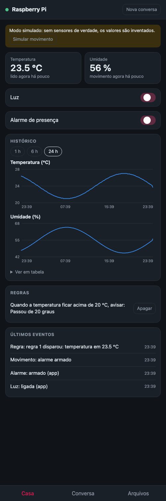

# Casa Inteligente com Raspberry Pi

Painel de automação residencial que roda em um Raspberry Pi 3B+ e é controlado
pelo celular. O Pi controla uma luz, acompanha temperatura e umidade, vigia a
casa com um alarme de presença e guarda tudo em um banco de dados. Um agente de
IA (Claude) entende pedidos em português e cria regras de automação.

Trabalho prático da disciplina de Engenharia de Dados, UEMG, Unidade Passos,
curso de Sistemas de Informação. Professor: Marcelo Nogueira de Almeida.

Integrantes: Matheus Vicente e Pablo Estevam.

> **Hardware desta entrega:** o Raspberry Pi é o único equipamento físico do
> projeto. Não há LED, sensores nem buzzer ligados a ele: a luz, o clima e o
> alarme rodam em **modo simulado** (`CASA_SIMULAR=1`), e o app avisa isso numa
> faixa. Todo o resto (servidor web, banco SQLite, regras, agente e as ações de
> rede e de status do Pi) roda de verdade no Raspberry Pi.



## O que o sistema faz

- **Luz:** liga e desliga a luz pelo app, pelo agente ou por uma regra.
- **Clima:** lê temperatura e umidade a cada 30 segundos (simuladas), grava no banco e mostra em gráfico.
- **Alarme:** com o alarme armado, um movimento manda um aviso para o celular. No modo simulado, o botão "Simular movimento" do app gera o movimento.
- **Regras:** "quando a temperatura passar de 30 °C, me avise" vira uma regra que o Pi avalia sozinho.
- **Agente:** conversa em português e executa as ações acima, além de olhar a rede e o estado do Pi.

A aba **Casa** do app fala direto com o Pi e funciona sem internet. Só a aba
**Conversa** depende de internet, porque o agente usa a API da Anthropic.

## Fluxo: entrada → processamento → saída

| Entrada | Processamento | Saída |
|---|---|---|
| Toque no app (rede) | `servidor.py` recebe e chama `casa.py` | Luz muda no app; evento gravado no banco |
| Leitura de clima (simulada) | `casa.py` lê a cada 30 s e avalia as regras | Leitura no SQLite, gráfico no app, ação da regra |
| Evento de presença (botão simular movimento) | `casa.py` verifica se o alarme está armado | Aviso no celular, evento gravado |
| Pedido em português (rede) | `agente.py` envia ao modelo, que escolhe uma ação de `ferramentas.py` | Ação executada e resposta no app |

## Materiais

- Raspberry Pi 3 Model B+ com Raspberry Pi OS (Debian 13) e cartão microSD de 16 GB
- Monitor ligado ao Pi (console)
- Computador (nos testes, um MacBook) para acessar o Pi por SSH
- Celular ou navegador na mesma rede Wi-Fi

## Montagem e conexões

Como o projeto usa só o Raspberry Pi, a montagem é colocá-lo na rede: ele fica
ligado à energia e ao monitor, conectado ao Wi-Fi da casa (nos testes, IP
`192.168.15.99`). O computador acessa o Pi por SSH (`ssh usuario@IP_DO_PI`) e o
celular abre o app pelo endereço do Pi na porta 8000.

Os pinos para uma futura montagem com componentes ficam em `config.py`
(numeração BCM): GPIO17 para a luz (LED), GPIO27 para o buzzer, GPIO22 para o
sensor de presença e GPIO4 para o sensor DHT. Nesta entrega eles não são usados.

## Instalação no Raspberry Pi

1. Copie o projeto para o Pi:
   ```bash
   git clone https://github.com/matheusvfarah/casa-inteligente-raspberry-pi.git ~/uemg
   cd ~/uemg
   ```
2. Instale os programas do sistema:
   ```bash
   sudo apt install -y python3-venv python3-gpiozero python3-lgpio nmap avahi-utils
   ```
3. Crie o ambiente Python. A opção `--system-site-packages` deixa o ambiente
   usar o `gpiozero` instalado pelo sistema:
   ```bash
   cd ~/uemg
   python3 -m venv --system-site-packages .venv
   .venv/bin/pip install -r requirements.txt
   ```
4. Inicie em modo simulado:
   ```bash
   export ANTHROPIC_API_KEY="sua-chave"   # opcional: só o agente precisa dela
   CASA_SIMULAR=1 .venv/bin/python agente.py
   ```

O programa mostra um link como `http://192.168.15.99:8000/?t=AbC123...`. Abra
no celular, na mesma Wi-Fi. O link é o mesmo a cada reinício, então dá para
fixar o app na tela inicial do celular. Para trocar o link, apague o arquivo
`.token` e reinicie.

### Modo simulado

Sem componentes ligados, o programa roda com `CASA_SIMULAR=1`, no Pi ou em um
notebook. A luz vira um objeto de mentira, a temperatura e a umidade variam em
torno de 24 °C e 55 % com um pequeno ruído, e o app mostra uma faixa avisando
que os valores são inventados, com um botão para simular movimento.

```bash
CASA_SIMULAR=1 python agente.py
```

### Subir junto com o Pi

Crie `/etc/systemd/system/casa.service` (troque `uemg` pelo seu usuário):

```ini
[Unit]
Description=Casa Inteligente
After=network-online.target
Wants=network-online.target

[Service]
User=uemg
WorkingDirectory=/home/uemg/uemg
Environment=CASA_SIMULAR=1
Environment=ANTHROPIC_API_KEY=sua-chave
ExecStart=/home/uemg/uemg/.venv/bin/python agente.py
Restart=on-failure

[Install]
WantedBy=multi-user.target
```

Depois: `sudo systemctl enable --now casa`.

## Como o código está organizado

| Arquivo | Papel |
|---|---|
| `config.py` | Pinos, intervalos e caminhos dos arquivos. |
| `banco.py` | Banco SQLite: tabelas `leituras`, `eventos` e `regras`. |
| `casa.py` | Lógica da casa: luz, alarme, clima e avaliação das regras (simulados; com hardware usa `gpiozero`). |
| `servidor.py` | Servidor web (biblioteca padrão) que atende o app do celular. |
| `ferramentas.py` | Lista fixa de ações que o agente pode executar. |
| `agente.py` | Ponto de entrada; conversa com o modelo e executa as ações pedidas. |
| `pagina.html` | O app do celular: abas Casa, Conversa e Arquivos. |

### Banco de dados

| Tabela | Colunas | Uso |
|---|---|---|
| `leituras` | `momento`, `temperatura`, `umidade` | Uma linha a cada leitura (a cada 30 s). |
| `eventos` | `momento`, `tipo`, `detalhe` | Luz, alarme, movimento e regras disparadas. |
| `regras` | `id`, `condicao`, `valor`, `acao`, `texto` | Regras de automação criadas pelo agente. |

`momento` é guardado em segundos desde 1970. Para o gráfico, `banco.historico()`
agrupa as leituras em médias, de modo que 24 horas viram cerca de 240 pontos.

### Regras de automação

Uma regra tem uma condição (`temperatura_acima`, `temperatura_abaixo`,
`umidade_acima`, `umidade_abaixo` ou `movimento`), um valor limite e uma ação
(`avisar`, `ligar_luz`, `desligar_luz` ou `tocar_buzzer`). Regras de
temperatura e umidade disparam uma vez, quando o limite é cruzado, e só voltam
a disparar depois que a medida retorna ao lado normal. As regras ficam no banco
e continuam valendo sem internet.

### Ações do agente

| Ação | O que faz | Pede confirmação |
|---|---|---|
| `controlar_luz` | Liga ou desliga a luz | não |
| `armar_alarme` | Arma ou desarma o alarme | não |
| `estado_da_casa` | Luz, alarme, última leitura e último movimento | não |
| `historico_da_casa` | Mínima, máxima e média do período | não |
| `criar_regra` | Cria uma regra de automação | sim |
| `listar_regras` | Lista as regras | não |
| `apagar_regra` | Apaga uma regra | sim |
| `escanear_rede` | Lista os dispositivos na Wi-Fi do Pi | não |
| `descobrir_servicos` | Lista serviços mDNS (AirPlay, Chromecast, impressoras) | não |
| `status_do_pi` | Temperatura da CPU, carga, memória e disco | não |
| `celulares_conectados` | Celulares com o app aberto | não |
| `enviar_aviso` | Mostra um aviso em todos os celulares | sim |
| `arquivos_recebidos` | Arquivos enviados pelos celulares | não |

As confirmações aparecem no celular como um cartão com Permitir e Negar.

## Testes realizados

Com o programa rodando no Raspberry Pi e o app aberto no navegador, em
emulação de iPhone 16:

- "Acenda a luz": o agente aciona a luz e responde.
- "Como está o Pi?": o agente lê a temperatura da CPU, a carga, a memória, o disco e o IP.
- "Que serviços há na rede?": o agente encontrou 4 aparelhos anunciando serviços.
- Aba Casa em modo simulado: clima, chaves de luz e alarme, gráfico e eventos (imagem acima).

## Segurança

- O agente não tem terminal: só executa as ações de `ferramentas.py`.
- O app exige o token do link; quem tem o link controla a casa, então não o compartilhe.
- A varredura de rede só roda na rede local do próprio Pi.
- A conexão é HTTP sem criptografia; use só em uma Wi-Fi de confiança.
- A chave da API fica só no Pi, em variável de ambiente, e não entra no repositório.

## Limitações

- O app só funciona na mesma rede Wi-Fi do Pi.
- A conversa com o agente se perde quando o programa reinicia; leituras, eventos e regras ficam no banco.
- Luz, clima e alarme funcionam em modo simulado, porque nenhum componente está ligado ao Pi.
- Com sensores reais, o código lê o DHT pelo driver do kernel (`dtoverlay=dht11,gpiopin=4` em `/boot/firmware/config.txt`) e tenta até quatro vezes, porque esse tipo de sensor falha em parte das leituras.
